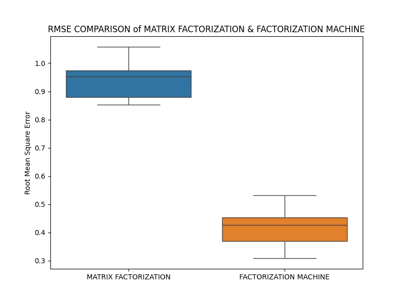

# Movie Recommendation System

## Overview
The goal of this project is to build a movie recommendation system that predicts user ratings for movies and provides personalized recommendations. We use a **Factorization Machine** model to capture the interaction between users and movies. The model is trained on a movie rating dataset and its performance is evaluated using **Root Mean Squared Error (RMSE)**. The current project demonstrates the process of data processing, training, comparison with a library-based model, and a basic recommendation system in the inference phase.


## Dataset Information

The dataset is built for a movie recommendation engine, combining movie metadata, user-generated tags, external links, and a comprehensive set of user ratings.

* **Files:** `movies.csv`, `ratings.csv`, `tags.csv`, `links.csv`
* **Total Ratings:** 100,836
* **Total Movies:** 9,742
* **Total Tags:** 3,683
* **Unique Users:** 610

### General Variables

| Variable | Description |
| :--- | :--- |
| **userId** | Unique identifier for each user who has rated or tagged a movie. |
| **movieId** | Unique identifier for each movie. |
| **title** | The full title of the movie, including the release year. |
| **genres** | Pipe-separated list of movie categories (e.g., Action, Drama). |
| **tag** | User-generated metadata or descriptive keywords. |
| **timestamp** | The time at which the rating or tag was recorded (Unix format). |
| **imdbId** | Reference identifier for the movie on IMDb. |
| **tmdbId** | Reference identifier for the movie on The Movie Database. |

### Target Variable

|Variable | Description |
| :--- | :--- |
| **ratings** | Numerical preference score (ranging from 0.5 to 5.0). The continuous target variable used for training to predict user preferences. |


## File Description

| File Name | Description |
|---|---|
| `Training_Phase_1.py` | Implemented Factorization Machine and Matrix Factorization. They analyze ratings, movies' genres and users' tags; then processe all into a feature matrix, train the model, and evaluate their performance with RMSE on a test set over multiple folds. |
| `Training_Phase_2.py` | Factorization Machine (FM) was selected over other models due to superior cross-validation performance. Trained from scratch using Stochastic Gradient Descent (SGD), it adapts the core structure of Training_Phase_1.py while optimizing specifically for the inference stage. Model accuracy is evaluated using RMSE. |
| `Inference.py` | Uses the trained model to predict ratings for unwatched movies for a specific user and generates a list of top recommended movies. |
| `Factorization_Machine_Library.py` | External re-built library of fastFM. |
| `RMSE_COMPARISON.png` | A visualization (a box plot) illustrating Interquartile Range of RMSE of models in `Training_Phase_1.py`.|
| `movies.csv` | Dataset containing information about movies (e.g., movie ID, title, genre). |
| `tags.csv` | Dataset with user-generated tags for movies. |
| `links.csv` | Dataset mapping movie IDs to external sources like IMDb and TMDb. |
| `ratings.csv` | The main dataset for this project, containing user ratings for movies. |


## Methodology

### 1. Data Understanding & Preprocessing
The model utilizes ratings.csv, containing userId, movieId, rating, and timestamp. The pipeline performs missing value checks and variable type verification to ensure data consistency. Features are then converted into a One-Hot Encoded sparse matrix, mapping individual user-movie interactions against the global set of all IDs.

### 2. Factorization Machine Model
The model predicts the rating $y$ as a sum of a global bias ($w_0$), linear terms for each feature ($w_i x_i$), and pairwise interaction terms between features ($\sum_{i=1}^{n}\sum_{j=i+1}^{n} \langle v_i, v_j \rangle x_i x_j$), where $v_i$ is a latent vector for feature $i$. This structure allows it to effectively handle the sparsity of the data.

### 3. Matrix Factorization Model
Matrix Factorization operates by decomposing the sparse user-item interaction matrix into two lower-dimensional rectangular matrices. These matrices represent Latent Factors—hidden characteristics that explain why a user likes a movie. By exploring implicit user-item relationship, the model "fills in the gaps" of the sparse matrix, allowing it to predict ratings for movies a user has not yet seen.

### 4. Robust Selection and Avoid Overfitting

K-Fold Cross-Validation: Both candidate models are trained and validated through multiple K-fold cycles. This process splits the data into K subsets, ensuring every data point is used for both training and validation, providing a stable estimate of model performance.

Performance Comparison: The RMSE results from each fold are collected and visualized using a Box Plot. This allows for a direct comparison of the error distribution, median performance, and variance between the models:

$$
\text{RMSE} = \sqrt{\frac{1}{N} \sum_{i=1}^{N} (y_i - \hat{y}_i)^2}
$$

Model Selection: The model demonstrating the lowest median RMSE and the highest stability (least spread on the box plot) is selected for the final training phase to build the structure for the Inference Stage.


### 5. Inference
For a given user, the trained model predicts the ratings for all movies they haven't rated. The movies are then sorted by their predicted ratings, and the top-K movies are recommended.

## Visualization and Analysis



This box plot displays a performance comparison between two recommendation system algorithms: Matrix Factorization and Factorization Machine, measured by Root Mean Square Error (RMSE).

The superior performance of the Factorization Machine in this comparison likely stems from its ability to model higher-order interactions between features. While standard Matrix Factorization typically focuses on user-item interactions, Factorization Machines can incorporate side information (metadata) and capture complex dependencies, which generally leads to the significantly lower RMSE observed here.

## Technical Stack

| Area | Technologies |
|---|---|
| **Programming Language** | Python 3 |
| **Libraries** | pandas, NumPy, scikit-learn (scikit-fm for library-based FM), matplotlib, seaborn, joblib, surprise, scipy |
| **Models** | Factorization Machines, Matrix Factorization (plus plus version) |
| **Techniques** | Alternating Least Squares (ALS), Stochastic Gradient Descent (SGD) |
| **Web Interface** | Streamlit |

## How to Run

1.  **Clone the Repository**:
    ```bash
    git clone [https://github.com/your-username/movie-recommendation-system.git](https://github.com/your-username/movie-recommendation-system.git)
    cd movie-recommendation-system
    ```

2.  **Install Dependencies**:
    Make sure you have Python and the necessary libraries installed:
    ```bash
    pip install pandas numpy scikit-learn matplotlib scikit-fm
    ```

3.  **Data Preparation**:
    Ensure `movies.csv`, `tags.csv`, `links.csv`, and `ratings.csv` (the full file) are in the same directory as the scripts.

4.  **Training and Comparison**:
    * To run the First-Phase Training:
        ```bash
        python Training_Phase_1.py
        ```
    * To run the Second-Phase Training:
        ```bash
        python Training_Phase_2.py
        ```

5.  **Inference (Recommendation)**:
    After training, you can use the inference script to get recommendations. You might need to update the script to load your trained model parameters:
    ```bash
    python Inference.py
    ```
> **Note:** Accessing to directory of scripts before running

## License

This project is licensed under the **CC-BY (Creative Commons Attribution)** license.

## Citation

Do, Chi Khoa (2026). *Sleep Health and Lifestyle Dataset Analysis and Prediction*.  

🔗 [Project Link](https://github.com/Dochikhoa2006/Sleeping-Disorder-Analysis)

## Acknowledgements

This README structure is inspired by data documentation guidelines from:

- [Queen’s University README Template](https://guides.library.queensu.ca/ReadmeTemplate)  
- [Cornell University Data Sharing README Guide](https://data.research.cornell.edu/data-management/sharing/readme/)  

The Factorization_Machine_Library.py is inspired by data documentation guidelines from:

- [Code Signal](https://codesignal.com/learn/courses/content-based-recommendation-systems/lessons/implementing-factorization-machines)
- [GeeksforGeeks](https://www.geeksforgeeks.org/machine-learning/probabilistic-matrix-factorization/)

This project utilizes the **Sleep Health and Lifestyle Dataset**, available on Kaggle:

- [MovieLens 100k Dataset](https://www.kaggle.com/datasets/abhikjha/movielens-100k)

## Contact
If you have any questions or suggestions, please contact [dochikhoa2006@gmail.com](dochikhoa2006@gmail.com).


